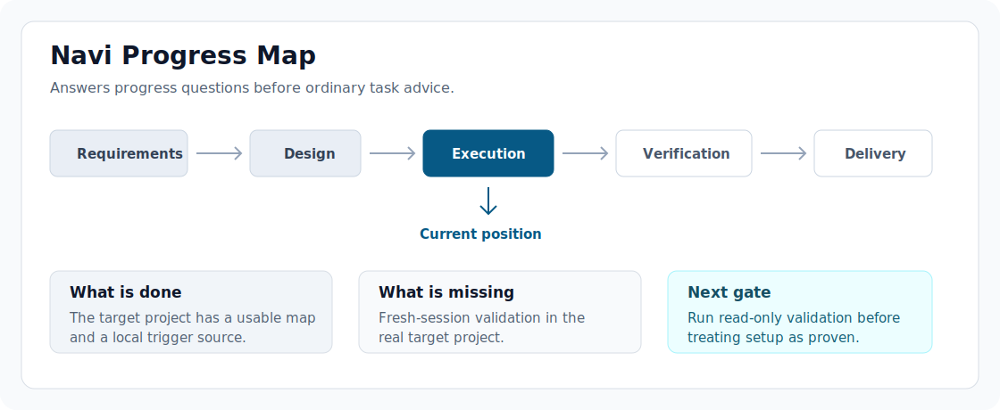

# Navi

English | [简体中文](./README.zh-CN.md)

Navi helps non-expert users understand, supervise, and steer expert agents.

GitHub source alpha | Codex project setup | MIT

Agent work is hard to supervise. Navi turns project progress, next steps, and risky momentum into readable maps for active Codex sessions.



Navi is an independent open-source product for supervising expert agents. It is the current alpha product you can inspect, install, and test today.

This repository is the canonical open-source alpha home for Navi. Current main branch behavior includes Progress/Rhythm Maps, Challenge Layer, pause semantics, stage/vision supervision, and coordination guidance. Navi shows where the project is, what is missing, whether to continue, when to stop, how much validation is enough, and whether parallel work should wait or continue.

## Distribution feasibility on current main

Latest tagged GitHub source release: `0.1.0-alpha.3`. Current main contains an unreleased Distribution feasibility candidate; it is not an activated public release entry.

The controlled primary design is a Git-backed `navi-source` marketplace. The checked-in root catalog remains a local source/calibration catalog, while the staging tool can render an immutable remote catalog and a local-marketplace bundle from the same plugin bytes.

Installed onboarding uses a package-local init entry resolved from the actually loaded Navi skill. It renders a read-only preview first and performs the fingerprint-bound write only after explicit approval. It does not require a source checkout, a hardcoded Codex cache path, or a bare `navi` command. If Node or the package entry is unavailable, Navi refuses direct project writes rather than installing a runtime silently.

The Public Plugin Directory is optional and is not a release prerequisite; Navi is not available there now. A GitHub Release local-marketplace ZIP, checksums, update, rollback, and uninstall promises belong to a later explicit Release plan. Bare `navi`, npm publication, a Bootstrap Installer, Runtime Surface, UI, MCP, background updates, and other-agent support are not ordinary-user prerequisites for this candidate. Real marketplace installation and cross-environment calibration have not happened in this implementation lane.

## Source-alpha setup

This alpha is a GitHub source package for Codex users and developers who are comfortable testing from a repository. Public npm/marketplace/one-click installation remains out of scope for this implementation lane; the current-main marketplace candidate is staged but not activated or released.

Verify the checked-out source before installation, then run this sequence from the repository root:

```bash
npm install
npm run verify:plugin-package
codex plugin marketplace add "$PWD"
codex plugin add navi@navi-source
npm link
navi doctor
navi setup
navi setup --write
```

If the active Codex environment cannot resolve bare `navi` after `npm link`, start diagnosis from the repository root with `npm run navi -- doctor`. Doctor reports the PATH limitation and carries one verified fallback into later setup or init guidance. The fallback does not edit PATH or shell configuration. Adding the linked npm bin directory to the PATH inherited by Codex and restarting Codex is optional convenience, not a prerequisite while the fallback works.

These are explicit user-run source-alpha operations. They mutate global Codex/plugin/npm state (including Codex configuration or cache and npm's global link state); `navi setup` does not install a plugin or run them for you. `navi doctor` is troubleshooting, not a normal daily step. It checks the source-alpha prerequisites and points to the appropriate repair when something is missing.

### Setup transaction safety

Global setup uses a recoverable transaction directory and a cooperative same-user lock. It verifies approved bytes, publishes without replacing an existing target, and preserves detected third-party content for manual resolution. This is a cooperative-concurrency boundary, not a claim of adversarial same-user atomicity; do not delete a lock or force a conflicted setup.

Setup once -> approve project init once -> use natural language.

Journey contract: global source setup once -> adaptive project evidence judgment -> user-confirmed Desired Outcome plus Outcome Boundary -> one v2 Map and managed-trigger preview -> one fingerprint-bound approved write -> fresh-session supervision -> material boundary revision only with user confirmation.

Compatibility shorthand for the same path: global setup once -> guided confirmed baseline -> one trigger + `.navi/project-map.md` preview -> one approved project init write -> fresh-session natural-language supervision.

Current source uses one visible, prompt/docs-backed project entry. Coherent evidence—not project maturity—selects the Evidence-First Candidate. Mature projects may have coherent, conflicting, insufficient, or stale evidence and follow the corresponding profile route; a direction conflict returns to the user, while insufficient evidence falls back to Guided Baseline Formation. Both paths use the same confirmed Map preview and fingerprint-bound write. This is not a runtime classifier or background repository scanner.

`navi setup` configures global discovery only: it does not initialize a target project. On the first broad supervision request in an unconfigured project, Navi checks whether Desired Outcome, Outcome Boundary, Route To Outcome, Current Position, Current Boundary, and Next Decision are confirmable. The baseline is confirmable only when it includes both Current Boundary and Next Decision. If not, Navi asks one focused question at a time without writing. Once the guided confirmed baseline is ready, Navi shows one exact preview for the confirmed Map and managed `AGENTS.md` trigger. One approval covers that bounded project write: the Map is written first and the trigger last. `navi init` does not reinstall the plugin.

Current main writes Project Map contract version 2 with a user-confirmed Outcome Boundary. Existing version-1 Maps remain readable and do not require immediate reinitialization. A version-1 Map can receive one fingerprint-bound approved Outcome Boundary augmentation; Navi does not migrate or rewrite it automatically. This current-main behavior remains unreleased until a later tag explicitly includes it.

Version 2 is required for every new or upgraded Map write, and that exact augmentation is the only Map migration accepted through `navi init`.

Existing confirmed Map trigger path (valid confirmed Map with a missing or recognized legacy trigger):

```text
navi init
navi init --expect-plan <fingerprint> --write
```

The first command previews the exact trigger action and prints its plan fingerprint. Run the second command only after that preview is approved.

Fresh confirmed Map candidate path (advanced/internal integration detail):

```text
navi init --map-file <confirmed-map-candidate>
navi init --map-file <confirmed-map-candidate> --expect-plan <fingerprint> --write
```

This is a Codex-guided candidate flow: Codex first helps the user form and confirm the baseline, then the adapter passes the confirmed candidate into the preview and approved write. It is not a manual baseline-formation workflow.

### Legacy migration and removal

If `navi doctor` reports a legacy-only installation, keep the exact reported legacy selector installed and add `navi@navi-source`. During the short dual-install transition, doctor keeps the installation unhealthy but performs read-only checks of the authoritative Current Navi selector, source path, and manifest. After those checks pass, run `codex plugin remove <exact legacy selector>` using the selector reported by doctor, rerun `navi doctor`, then preview and explicitly approve `navi setup --write`. Do not keep both plugins active as a compatibility mode.

This global cutover does not scan or initialize target projects. On the next use of a project with a recognized legacy trigger, Current Navi may offer the existing fingerprint-bound `navi init` upgrade. Declining that project-local upgrade does not undo global activation and should not cause repeated reminders in the same session.

To remove this source-alpha setup yourself:

```bash
navi setup --remove
navi setup --remove --write
codex plugin remove navi@navi-source
codex plugin marketplace remove navi-source
npm unlink -g navi
```

For more setup detail, follow:

- `docs/navi/project-init.md`
- `docs/navi/project-trigger-template.md`

The minimum reliable project configuration is a confirmed `.navi/project-map.md` and the short managed trigger in `AGENTS.md`. After that setup, ordinary questions like `What should we do next?`, `Where are we now? I do not understand.`, or an unclear `Continue.` should produce Navi supervision before ordinary task advice. Chinese prompts such as `接下来我们应该做什么？` are supported too.

Navi maps should follow the user's current prompt language by default. If a target project's saved Project Map or Rhythm Map uses labels in another language, Navi should translate or bilingualize those labels in the current answer rather than returning a full map in the saved record's language.

## Who This Alpha Is For

Use this alpha if you want to test Navi's current supervision behavior in active Codex sessions, review the plugin source package, or give feedback on whether Progress/Rhythm Maps and Challenge Layer behavior help non-expert users steer expert-agent work.

Wait for a later release if you need npm distribution, an activated public marketplace release, a Public Plugin Directory listing, one-click sync, runtime UI, background watching, operating-system or background notifications, or adapters for agents outside Codex.

## Alpha Status

Latest tagged GitHub source release: `0.1.0-alpha.3`.

Current main branch: includes unreleased post-`0.1.0-alpha.3` work, including the Lane Handoff and Supervised Delivery Loop behavior described below. Lane Handoff remains unreleased, and Supervised Delivery Loop remains unreleased, until a later tag explicitly includes them.

What is stable in this alpha:

- Navi Progress Maps for progress, next-step, continue, done, confusion, and plan-reliability questions.
- Rhythm Maps for flowing long-running projects with recurring cycles, waiting states, parallel opportunities, and decision gates.
- Challenge Layer behavior for anti-self-certification moments.
- Pause semantics for continue/stop boundaries and meaningful decision points.
- Stage/vision supervision for product stage, work mode, and distance from the original goal.
- Coordination guidance for worktrees, review/merge timing, external waits, and non-conflicting main-session work.
- Prompt-language following for Navi maps in multilingual target projects.
- Working Thread continuity for project judgment that needs durable carry-forward.
- Project-local Navi initialization through `navi init`, `AGENTS.md`, and `.navi/project-map.md`.
- Codex skill/plugin behavior with project-local docs.
- source package verification through `npm run verify:plugin-package`.

What is not included:

- npm package publication.
- An activated Git-backed marketplace release or Public Plugin Directory listing.
- Real installed-marketplace calibration or one-click sync.
- It has no background watcher, operating-system notification service, or always-on presence; bounded Lane Handoff uses available Codex task messaging only while Codex is active.
- Runtime UI or future local app surface.
- Hermes, Claude Code, or other agent adapters.
- Memory v2, relationship modes, delegation, or write delegation.

The root `package.json` intentionally remains `"private": true` to prevent accidental npm publication. The source is available under the MIT license for GitHub alpha use.

## Relationship To Along

Along is the parent/lab context and broader long-term product family. Navi is an independent product surface from that work and should be understandable without knowing Along.

Use Along to understand origin and future-family context. Use Navi to understand the current alpha product, setup path, and supervision behavior.

## Current V1 shape

Current V1 uses skill/plugin behavior with project-local docs. The repo-contained Codex plugin source package lives at:

```text
plugins/navi
```

Current installation, discovery, and project triggers use Navi identifiers only. `along-working-thread` is a legacy installation identifier: keep it only for explicit doctor-guided migration, not for a new installation.

Navi V1 is docs-backed and turn-bound. It works while an active agent session is running; it does not watch files, send operating-system or background notifications, or act when Codex is closed.

When a bounded Codex worktree has source-task metadata and host task messaging, Navi can deliver one `decision-required`, `blocked`, or `review-ready` transition back to the source main task. This is Codex task-to-task coordination during an active session, not a background watcher, user notification service, durable queue, or automatic permission to resume, merge, push, or release.

### Codex-first Supervised Delivery Loop

Current main includes an unreleased, prompt/docs-backed Supervised Delivery Loop for approved bounded implementation work. The persistent Main Thread owns goals and decisions, a worktree Execution Thread changes files and returns evidence, and one fresh read-only Validation Thread independently reviews the exact snapshot before acceptance.

The loop uses Codex host task creation and task-to-task messaging during the active session while the source task is active. It is not a scheduler, not a durable queue, not a watcher, and not a background service, and it does not automatically merge, push, tag, or release. Permission, scope, architecture, known-risk, integration, and publication decisions remain explicit.

## What Navi Does

Navi Progress Maps are for questions like:

```text
What should we do next?
Where are we now? I do not understand.
Continue.
Is this plan okay? I am not technical.
```

For a bounded project, Navi should use a compact project map:

```text
[需求] -> [设计] -> [执行] -> [验证] -> [交付]
                         ^
                      当前位置
```

For a flowing long-running project, Navi should use a Rhythm Map instead of forcing a completion bar:

```text
[Cycle refresh] + [Daily preparation] + [Opportunity/object waiting] + [Decision confirmation]
                                      ^
                                  Current focus
```

Chinese prompts can use Chinese map labels:

```text
[周期刷新] + [日常准备] + [机会/对象等待] + [决策确认]
                                      ^
                                   当前焦点
```

Challenge Layer behavior appears when the map reveals drift, weak assumptions, premature execution, or self-certifying momentum. Its job is to turn questionable momentum into lightweight validation, not to criticize every decision.

## Verify The Source Package

Install dependencies:

```bash
npm install
```

Verify the repo-contained Navi plugin source package:

```bash
npm run verify:plugin-package
```

Run the full local checks:

```bash
npm test
npm run typecheck
```

For local Codex plugin experimentation, use `plugins/navi` through the source marketplace commands above.

This alpha includes a narrow project-local initializer. With no confirmed Map, direct `navi init` reports that the baseline must be formed in Codex and makes no changes. After the guided confirmation flow supplies the approved Map, init previews the exact Map-and-trigger action and binds the approved write to that plan fingerprint. It prepares one target project for Navi behavior; it does not install or sync the global Codex plugin or skill. Use the two contextual command paths above rather than treating a write flag as a standalone initialization command.

## Alpha Feedback We Want

The most useful alpha feedback is evidence from real or realistic target projects:

- Did ordinary progress, next-step, confusion, continue, and plan-reliability questions trigger a useful Navi map?
- Did flowing projects use Rhythm Maps instead of misleading completion bars?
- Did Challenge Layer behavior catch weak assumptions or self-certifying momentum without becoming constant critique?
- Did narrow factual checks and clear execution requests stay quiet?
- Did `navi doctor` make a legacy-only or dual-install diagnostic understandable without changing global state automatically?

## Project-Local Setup

For reliable Navi behavior in a target project, use:

- a project-local trigger source in `AGENTS.md`;
- the confirmed `.navi/project-map.md`;
- the target project's source records, such as state files, TODO files, trackers, workflow records, and handoffs.

Reusable setup docs:

- `docs/navi/project-init.md`
- `docs/navi/project-trigger-template.md`

## Architecture Boundary

MCP, runtime, local app, background presence, companion memory, and adapter surfaces are experimental or later layers unless explicitly called out for a focused validation pass.

The repository still contains older Along companion ideas, including local memory, Shared Desk, soundscape, and `.along/` runtime concepts. Treat those as historical or future-facing context, not the current recommended Navi installation path.

`archive/along/src/web` is not the Navi alpha UI.

## Release Notes

See `CHANGELOG.md` and `docs/releases/v0.1.0-alpha.3.md` for the latest alpha release notes.

## License

MIT. See `LICENSE`.
