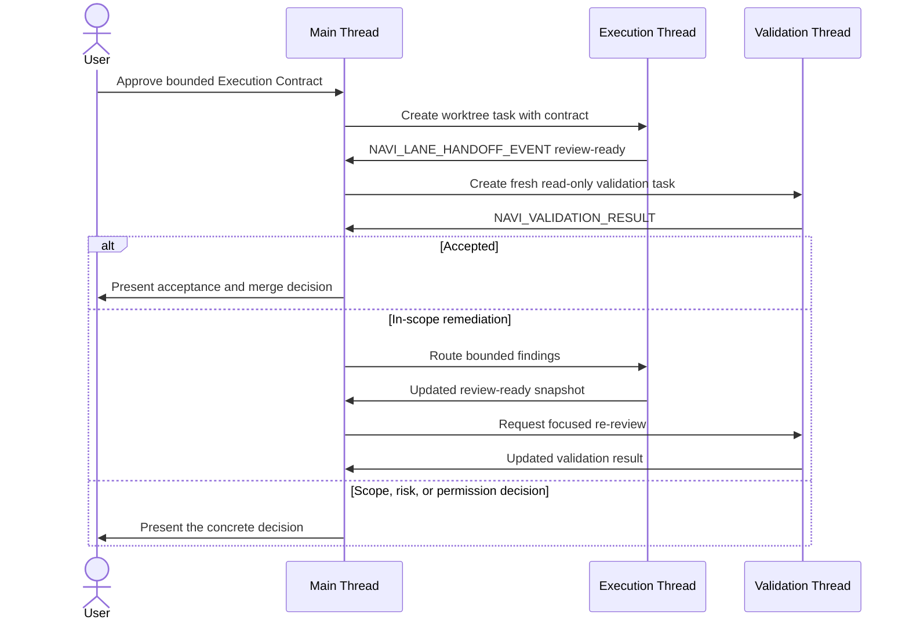

# Navi Supervised Delivery Loop Design

Date: 2026-07-14

Status: Approved in design discussion on 2026-07-14

## Summary

Navi should add a Codex-first **Supervised Delivery Loop** for bounded
implementation work. The loop separates three responsibilities:

1. the persistent Main Thread owns goals, scope, priority, acceptance, and
   user-facing decisions;
2. a bounded Execution Thread changes files and returns evidence; and
3. a fresh Validation Thread independently reviews the result, risks, and
   omissions before the Main Thread asks for merge or another consequential
   action.

The purpose is not to maximize testing or create more agent ceremony. It is to
let the user supervise outcomes without becoming the information bus between
Codex tasks, while preserving an independent check between implementation and
acceptance.

Every worktree implementation receives an independent Validation Thread
review. Review depth varies with observable scope and risk, but the independent
review itself is not optional. The Execution Thread remains responsible for the
tests required by its approved acceptance contract. The Validation Thread
audits the result and runs only bounded checks needed to investigate a concrete
doubt. Full release verification remains a separate Release-mode concern.

This design extends Navi's existing Main Lane, Implementation Lane, Review /
Merge Lane, and Lane Handoff behavior. It remains prompt- and docs-backed. It
does not add a scheduler, durable queue, watcher, runtime service, automatic
merge, automatic push, or automatic release.

## Problem

The current worktree workflow already separates the main conversation from
file-changing implementation, but it has two gaps.

First, implementation evidence is often reviewed inside the execution lane or
reported directly by the implementer. That can be useful, but it does not give
the Main Thread a consistently fresh, independent assessment of the exact
result it may accept.

Second, cross-task coordination can still make the user act as an information
bus. A user may have to notice that a worktree is blocked or complete, inspect
another task, copy its result into the Main Thread, and then carry the Main
Thread's answer back. This interrupts product design and makes correct routing
depend on the user's operational attention.

The opposite failure is also possible: adding a permanent executor, mandatory
full test lane, background coordinator, or large message protocol would make
Navi more complex without creating proportional user control.

The design therefore needs the smallest loop that provides:

- persistent product judgment in the Main Thread;
- isolated and bounded file changes;
- a fresh independent review;
- automatic task-to-task routing through the Main Thread;
- no repeated approval for already authorized in-scope remediation; and
- explicit user control at real scope, risk, permission, merge, push, tag, and
  release boundaries.

## Goals

The Supervised Delivery Loop should:

1. separate decision ownership, file-change ownership, and independent review;
2. prevent the user from manually relaying routine worktree status and review
   findings between Codex tasks;
3. require independent review for every bounded worktree implementation while
   scaling review depth to risk;
4. keep planned testing in the Execution Thread and release testing in explicit
   Release mode;
5. reuse the same bounded lanes for in-scope remediation instead of repeatedly
   creating new tasks;
6. cap remediation so the loop cannot pursue a zero-finding ideal forever;
7. preserve exact-snapshot review and explicit evidence provenance; and
8. remain quiet when no user decision or control gain exists.

## Non-Goals

This design does not:

- create a permanent executor that accumulates unrelated implementation work;
- make the Validation Thread a second implementation lane;
- make the Validation Thread run a full suite after every change;
- guarantee that independent review will find an issue or change an acceptance
  decision;
- let the executor and validator coordinate privately outside Main Thread
  supervision;
- create a durable message queue, daemon, scheduler, watcher, or always-on
  background process;
- persist arbitrary agent reasoning or full task transcripts;
- automatically merge, push, tag, release, expand scope, accept known risk, or
  grant new filesystem or network permissions;
- replace explicit Release mode or its release-level verification budget;
- generalize the V1 workflow beyond Codex before Codex behavior is calibrated;
  or
- add a mandatory visible three-role diagram or status table to ordinary Navi
  responses.

## Role Model

### Main Thread

The Main Thread is persistent across the product discussion and delivery loop.
It owns:

- the product goal and why the work matters;
- the bounded task scope and forbidden scope;
- priority relative to other product work;
- the acceptance contract and validation level;
- routing between execution, validation, remediation, and user decisions;
- the final acceptance judgment; and
- requests for merge, push, tag, release, permission, scope expansion, or known
  risk acceptance.

The Main Thread may continue non-conflicting design or supervision while an
Execution or Validation Thread is active. A lane-level wait is not a whole-
session wait. It pauses only when the pending result can change the current
premise or when all useful non-conflicting work depends on that result.

The Main Thread does not edit files as a substitute for an active bounded
Execution Thread and does not self-certify the implementation it coordinated.

### Execution Thread

An Execution Thread is a Codex-managed isolated worktree task created for one
bounded implementation goal and baseline. It owns:

- modifications within the approved file and behavior scope;
- planned targeted, integration, or full tests named in the acceptance
  contract;
- local task commits when those commits were explicitly included in the
  approved bounded plan;
- a clean reviewable snapshot; and
- an evidence package describing changes, verification, and residual risk.

The same Execution Thread is reused for remediation of findings that remain
inside the original goal, scope, authority, and validation budget. A new goal,
new baseline, materially expanded scope, or revised architecture gets a new
Execution Thread rather than turning the old lane into a permanent worker.

### Validation Thread

A Validation Thread is a fresh, read-only reviewer created only after the
Execution Thread reaches `review-ready`. It owns an independent assessment of:

- whether the snapshot satisfies the approved contract;
- whether the diff changes behavior outside the declared scope;
- whether the supplied evidence supports the claims;
- whether important risks, failure cases, or omissions remain; and
- whether the result is acceptable, needs bounded remediation, needs a user
  decision, or cannot yet be verified.

The validator receives the contract, exact snapshot, changed scope, evidence,
and known risks. It does not receive the executor's full transcript or private
reasoning. Independence means a fresh review context and direct reporting to
the Main Thread; it does not mean that the review is guaranteed to disagree.

The validator may run bounded targeted checks to resolve a concrete doubt. It
must not edit files, implement fixes, expand test scope without authorization,
merge, push, tag, release, or accept product risk. If it writes to the target
worktree, its result is invalid and the Main Thread must restore a clean review
boundary before continuing.

## Thread Lifecycle

The lifecycle is intentionally hybrid:

- the Main Thread persists;
- each bounded implementation goal receives a new Execution Thread;
- each review-ready execution lane receives one fresh Validation Thread;
- the same executor-validator pair is reused for in-scope remediation and
  focused re-review;
- the pair closes after acceptance, rejection, abandonment, or integration;
  and
- new scope, a new plan, or a new baseline creates a new pair.

The Validation Thread is not created when implementation begins. Creating it at
`review-ready` gives it one exact review snapshot, avoids idle tasks, and keeps
the review context independent from implementation narration.

## Contracts And Packages

### Execution Contract

Before creating the worktree, the Main Thread records:

- goal and user value;
- source Main Thread and source task identifiers;
- baseline commit or snapshot;
- allowed files and behavior scope;
- forbidden scope and forbidden escalations;
- expected implementation plan or bounded task list;
- required verification and its maximum budget;
- assigned validation level;
- stop conditions and handoff format; and
- preauthorization to create one Validation Thread and route in-scope
  remediation through the same executor-validator pair.

The preauthorization removes repeated user approvals for routine review and
in-scope remediation. It does not authorize new permissions, scope expansion,
unknown staged content, merge, push, tag, release, or known-risk acceptance.

### Review Package

At `review-ready`, the Execution Thread sends the Main Thread a structured
package containing:

- event ID, source task, and source lane;
- goal and declared impact;
- exact commit or immutable snapshot identifier;
- changed files and behavior summary;
- verification commands and results;
- worktree cleanliness;
- residual risks and unresolved uncertainty; and
- the recommended next transition.

This uses the existing `NAVI_LANE_HANDOFF_EVENT` delivery contract. Duplicate
event IDs are idempotently ignored.

### Validation Contract

The Main Thread creates the fresh Validation Thread with:

- the approved Execution Contract;
- the exact review snapshot;
- the Review Package and evidence locations;
- the assigned validation level;
- explicit read-only and command-budget boundaries;
- severity and verdict definitions; and
- instructions to report directly to the Main Thread.

The contract excludes the executor's full transcript, implementation reasoning,
and self-review conversation. The validator may inspect repository evidence
needed to understand the contract and diff.

### Findings Package

The validator returns a structured `NAVI_VALIDATION_RESULT` package containing:

- unique result ID and the reviewed event ID;
- source task, execution lane, and validation lane IDs;
- reviewed commit or snapshot;
- assigned and actually used validation level;
- verdict;
- findings ordered by severity with file and evidence references;
- checks run, if any, and their results;
- evidence gaps or inability to verify; and
- a bounded recommendation to accept, remediate, decide, or stop.

The package is a separate result type rather than overloading
`NAVI_LANE_HANDOFF_EVENT`'s `review-ready` transition. Duplicate result IDs are
ignored. A result for the wrong snapshot is stale evidence and cannot authorize
acceptance.

## Communication And Routing

Execution and Validation Threads do not communicate directly. The Main Thread
is the router and decision owner; the user is not the transport layer.

Codex host task operations provide the V1 transport: task creation, source task
identifiers, task messages, and structured plain-text envelopes. Delivery is
active-task coordination, not durable workflow infrastructure. Navi does not
poll continuously. A task emits only at meaningful transitions, and the Main
Thread processes a delivered event at the next natural checkpoint unless it
changes a current premise or exposes a real blocker.

When exact-snapshot task creation is not available, V1 may create a controlled
temporary read-only review checkout at the reported commit. The Main Thread
must state that fallback honestly. It must not claim a stable automation or
snapshot guarantee that the Codex host does not provide.

## Validation Depth

The Main Thread chooses validation depth in the Execution Contract from
observable scope, coupling, reversibility, and user risk. It does not guess
whether a validator is likely to find something.

### Level 1: Brief Independent Review

Use for narrow, low-risk, easily inspectable changes.

The validator reads the contract, diff, and supplied evidence. It runs no
commands by default. It checks scope, claim-evidence alignment, obvious
omissions, and whether acceptance is supportable.

### Level 2: Standard Review

Use for ordinary product behavior, documentation contracts, CLI changes, or
changes spanning related modules.

The validator inspects related owners and tests, traces affected behavior, and
may run focused checks to investigate a concrete uncertainty. It does not
repeat every executor command merely to create a second green transcript.

### Level 3: Critical Boundary Review

Use for authorization, filesystem safety, migrations, cross-module contracts,
dependency boundaries, or changes with costly failure modes.

The validator examines failure paths, cross-boundary effects, and declared
invariants. It may run an approved bounded integration suite. Level 3 is still
not Release mode and does not silently trigger the repository's entire release
checklist.

## Test Ownership

Testing responsibility follows the work mode and decision being supported:

- the Execution Thread runs the targeted, integration, or full tests explicitly
  required by its approved implementation contract;
- the Validation Thread audits those results and runs only bounded checks needed
  to verify a concrete concern;
- the Main Thread judges whether the combined evidence satisfies acceptance;
  and
- a Release or Verification Lane runs full release verification only after the
  user explicitly enters Release mode.

An implementation contract may require a full product suite when shared core
logic or a high-blast-radius migration genuinely warrants it. That requirement
belongs to the planned execution acceptance criteria, not to a blanket rule
that every validator repeats the full suite.

## Findings And Remediation

Findings use three severities:

- **Critical**: the result is unsafe, violates an authorization boundary, loses
  data, or cannot be accepted without changing the premise;
- **Important**: the approved contract is not met, a meaningful regression or
  omission exists, or evidence is insufficient for acceptance; and
- **Minor**: a bounded quality issue that does not invalidate acceptance and can
  normally become explicit debt.

The validator returns one of four verdicts:

- `accept`: no Critical or Important issue prevents acceptance;
- `remediation-required`: findings can be corrected inside the approved
  contract;
- `decision-required`: resolving the issue needs scope expansion, risk
  acceptance, new permission, architecture change, or another user judgment;
  or
- `unable-to-verify`: the snapshot, evidence, environment, or tool boundary does
  not support a reliable conclusion.

The loop allows one initial independent review and at most two in-scope
remediation rounds. A remediation re-review examines the original findings, the
new delta, and necessary regression evidence; it does not restart an unbounded
whole-system audit.

If the same Critical or Important issue remains after two remediation rounds,
the Main Thread stops the loop and reassesses the plan, architecture, or
acceptance criteria. Minor findings default to explicit debt unless the Main
Thread determines they materially affect the current decision. The goal is a
supportable acceptance decision, not a zero-finding report.

## Failure Handling

The loop handles coordination failures explicitly:

- duplicate handoff or validation IDs are ignored idempotently;
- failure to create a validator leaves the lane `validation-pending`, not
  accepted;
- a missing or mismatched snapshot produces `unable-to-verify` or stale
  evidence;
- insufficient evidence is returned to the executor only when the missing
  evidence is already inside the approved contract;
- a validator that modifies the target snapshot invalidates its result;
- host messaging failure uses an explicit local fallback and is not represented
  as successful automatic delivery;
- a formally blocked execution lane reports through Lane Handoff rather than
  waiting for the user to discover it; and
- when Codex tasks are closed, Navi makes no promise of background continuation
  or later delivery.

Failures that require permissions, scope expansion, risk acceptance, merge,
push, tag, or release return a concrete decision to the user. Ordinary status
and already-authorized remediation do not.

## Product Placement And Sequencing

The Supervised Delivery Loop belongs in Navi's User Supervision and Codex-first
coordination surface. It extends existing concepts rather than adding another
top-level work mode:

- Main Lane remains the decision and product-judgment lane;
- Implementation Lane becomes the bounded Execution Thread;
- Review / Merge gains a distinct read-only Validation Thread before acceptance;
- Lane Handoff carries execution transitions to the Main Thread; and
- `NAVI_VALIDATION_RESULT` carries independent findings back to the Main Thread.

The three roles are workflow responsibilities, not new Navi Work Modes. Design,
Calibration, Implementation, and Release remain the four Work Modes.

This design should not move directly into implementation while the approved
complexity-stabilization work is still awaiting integration and calibration.
The intended sequence is:

1. complete parent review and the explicit integration decision for complexity
   stabilization;
2. calibrate the stabilized Current Navi surface in real projects;
3. use this design to create a bounded implementation plan;
4. implement the smallest prompt/docs-backed Codex-first loop; and
5. calibrate it on the first natural bounded worktree before considering wider
   product claims.

## Acceptance Scenarios

### Scenario 1: Level 1, No Findings

A narrow worktree reaches `review-ready`. The Main Thread automatically creates
one fresh Level 1 validator under the preauthorized contract. The validator
reviews the exact snapshot and returns `accept`. The user receives the concise
acceptance evidence and the real merge decision. The user does not relay task
messages, approve validator creation, type `continue`, or wait for a redundant
full test run.

### Scenario 2: In-Scope Important Finding

The validator reports an Important issue that fits the original scope. The Main
Thread routes it to the same Execution Thread. The executor fixes only that
finding and returns a new snapshot. The same validator performs a focused
re-review and returns a new result. The user is not asked to authorize the
already-bounded remediation and the loop does not restart from scratch.

### Scenario 3: Out-of-Scope Finding

The validator finds that a correct fix requires a new dependency, broader file
scope, architecture change, or risk decision. It returns `decision-required`.
The Main Thread explains the concrete choice, impact, and recommendation to the
user. No lane silently expands its authority.

## Deterministic Verification

The later implementation should include focused deterministic coverage that
proves:

- an Execution Contract includes validation preauthorization and a validation
  level;
- one `review-ready` transition creates at most one Validation Thread;
- duplicate handoff and validation result IDs are deduplicated;
- the Validation Contract excludes the executor's full transcript;
- a Findings Package identifies the reviewed snapshot, verdict, findings, and
  evidence;
- all four verdicts route to the correct next owner;
- in-scope remediation returns to the same executor-validator pair;
- the two-remediation cap stops repeated Critical or Important findings;
- validator writes invalidate the review boundary; and
- ordinary implementation validation does not trigger Release-mode testing.

These tests should validate stable contracts and routing behavior rather than
large repeated prose fragments.

## Real-Project Calibration

The first natural bounded worktree after integration should calibrate the whole
loop. Success indicators are:

- user manual message relays: 0;
- extra `continue` prompts caused by hidden routing: 0;
- duplicate validators for one review snapshot: 0;
- extra user approvals for in-scope remediation: 0;
- unauthorized full test or release-checklist runs: 0;
- merge, push, tag, release, scope, permission, and known-risk decisions remain
  explicit;
- the Main Thread can continue non-conflicting design while other lanes run;
  and
- the user can understand whether the result should be accepted, fixed,
  rejected, or reconsidered.

The current complexity-stabilization worktree is useful early evidence because
it used implementation and review subagents and surfaced real ownership and
truthfulness issues. It is not a formal pass for this design: its reviewer was
created and coordinated inside the Execution Thread, findings first returned to
that thread's coordinator, and the Main Thread did not directly create and own
the fresh validator contract.

## Presentation Asset

The approved three-role sequence diagram is useful future product-introduction
material. When Navi's product surface is ready for external introduction, keep
the Mermaid source as the maintainable authority and export an SVG with
accessible text and a short boundary note. Do not place the diagram in the
current README merely because the workflow has been designed; external claims
must wait until the behavior is implemented and calibrated.

## Exit Condition

This design is ready for implementation planning only after:

- the written specification is reviewed by the user;
- complexity stabilization has completed its parent review and explicit
  integration decision;
- the stabilized Current Navi surface has enough calibration evidence to avoid
  rebuilding obsolete boundaries; and
- the implementation plan remains bounded to prompt/docs-backed Codex task
  coordination.

Meeting the exit condition authorizes implementation planning, not file changes,
worktree creation, merge, push, tag, or release.
